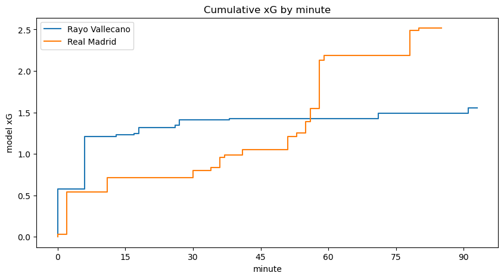

# Analysis of Expected Goals (xG) as a metric in football.
Data Science Capstone project exploring the xG metric in football.

# Authors:
Senyo Ohene

# Abstract
This project proposes a machine-learning-based method of determining the expected goals (xG) metric, which is the expectation from 0 to 1 that a goal will be scored from a particular shot. I examine full seasons from five different country football leagues and train five basic machine learning models to output probabilities that a shot will score based on some of the shot's characteristics. I find that a model of performance comparable to industry benchmarks can be built based on the distance, angle, shot type and other features of a shot. Furthermore, I find that distance of a shot is the most important feature in determining the expectation of a goal.

# Introduction
Football is a game of goals, in which individual moments matter disproportionately as compared with other sports. At the most recent FIFA World Cup in 2022, there were 172 goals scored in 64 matches, giving an average of 2.69 goals per match. Since goals occur so infrequently, an individual goal is worth more than in other sports, and there is incentive for football teams and players to invest in creating chances that maximize their goal scoring expectations.

Hewitt et al. use machine learning to build an expected goals model that adjusts for particular players and player positions in [1]. Rathke proposes a simple method based on simple ratios of goals scored to shots taken for different sections of the football field in [2]. Brechot et al. propose that examining teams' performance using expected goals is better than using the number of points they have at a particular point in the season in [3]. Lastly, Spearman uses spatiotemporal data to quantify the probability of a player scoring at any point during a match in [4].

Fans of football who have watched the sport for any period of time intuitively have some idea of how likely it is that a shot will result in a goal; for example, it reasonable to have a higher expectation that a goal will result from a shot taken 2 meters away from an empty goal than from a shot taken from the center circle of the field toward a goal where the keeper is waiting in the middle of the goal. However, quantifying this expectation, or the expectation that such a shot will result in a goal, requires a more comprehensive and more involving process.

Current industry leaders in the sport analytics world have expected goals models that vary slightly from each other in value, which implies that they use different algorithms to generate their expectations.

The goal of this project, then, is to use machine learning to develop a simple model that gives the expectation that a goal will be scored from a shot, whose usefulness is comparable to industry benchmarks, and also get an idea of which factors contribute the most to high quality chances.

# Methods
## Data
This project uses data from the 2015/16 seasons of the Premier League, La Liga, Bundesliga, Ligue 1 and Serie A soccer leagues obtained from Statsbomb (https://github.com/statsbomb) [5], which serves as my benchmark. For each league, all shots taken in the first 75% of matchweeks of the league were added to a dataframe with the following attributes
- location (where the shot was taken)
- shot type (whether the shot was from open play, or a penalty, corner kick or free kick)
- shot technique (whether the shot was kicked facing the goal, over the head, with the back of the heel, lobbed over the keeper, etc.)
- shot body part (whether the shot was played with the left foot, right foot, head or other body)
- under pressure (whether the shot was taken under pressure from an opponent or not)
- minute (what minute the shot was taken)
- player position (the position of the player taking the shot i.e. defender, midfielder, striker etc.)
- shot first time (whether the shot was taken at once by the player, or the player had possession prior to shooting)

This resulted in a separate dataframe for each league, each with at least 5,500 shots.

The shot outcome (whether a goal was scored from the shot or not) was also added to each dataframe to eventually be used as a target attribute to train the models. 

It is important to note that more data features could theoretically be added, but only subject to availability. Some features that were not added (due to difficulty of access), were goalkeeper position, stronger foot of the player and number of defenders between the ball and the goal at the moment the ball was struck, among others.

The following features are calculated using the location of the shot and added to the dataframes:
- distance (the distance from the shot location to the center of the goal)
- angle (the angle between the line from the shot location to the center of the goal and the line perpendicular to the goal line passing through the center of the goal)

I apply some preprocessing steps, such as transforming the shot outcome to a binary attribute. I am only interested in whether a shot resulted in a goal or not. My model takes no note of whether a shot that did not result in a goal missed the target, was saved, was blocked, or hit the crossbar, just that it did not score.
I remove any shots from corner kicks, since their rarity makes them a problem for the models.
I convert boolean features from having values of True and nan (not a number) to True and False.
I separate my data into nominal (features with Boolean or descriptive values) and numerical features. Nominal features are imputed, one-hot encoded and scaled. Numerical features are imputed and scaled. 

To get a sense of the performance of teams in comparison to Statsbomb's expected goals metric, I plot a chart of the goals scored compared to the expected goals (according to Statsbomb) of the five highest teams in each league. For example, below is the graph of the highest scorers in Ligue 1:

## Models
Finally, the following models are trained on the features, using the shot outcome as a target attribute:
The project constructs an expected goals model comparable to the benchmark (Statsbomb's) expected goals, using five different classifiers. Default implementations of Logistic Regression, SGDClassifier, GradientBoostingClassifier, RandomForestClassifier, and DecisionTreeClassifier from sklearn (https://scikit-learn.org) are used.

I plot all the shots displaying their statsbomb xg and their proposed model xg for five different classifiers output using the function predict_proba(), which is a function of each classifier which provides the probability that a shot resulted in a goal.

## Model selection
The shots were used to train five classifiers, and the results were displayed to show their correlation with the Statsbomb xG. The model selection was based on the following characteristics:

- Range of values: it has a wide enough range of values to be realistic. The sample size of shots means that there should be a reasonable spread of goal expectation values. This is measured based on an eye test, with the reasoning that with a sufficiently high set of shots, there should be a wide spread of goal expectations.
- Correlation with the industry benchmark. While the hope is to compare performance with the benchmark, and possibly improve it, it is unlikely that our proposed model's performance will be a vast improvement on the benchmark. I measured correlation using $R^2$ and also took into account the gradient of the trendline of the graph.

The $R^2$ values and gradients for each model in each league are displayed below:

Premier League:
|Metric|Logistic Regression |SGDClassifier| Random Forest Classifier | Gradient Boosting Classifier| Decision Tree Classifier | 
|---|---|---|---|---|---|
|$R^2$|0.304|0.334|0.530|0.579|0.170|
|Gradient|0.98|0.74|0.69|0.89|0.18|

La Liga
|Metric|Logistic Regression |SGDClassifier| Random Forest Classifier | Gradient Boosting Classifier| Decision Tree Classifier | 
|---|---|---|---|---|---|
|$R^2$|0.310|-0.181|0.537|0.654|0.187|
|Gradient|1.03|1.15|0.72|0.91|0.21|

Serie A
|Metric|Logistic Regression |SGDClassifier| Random Forest Classifier | Gradient Boosting Classifier| Decision Tree Classifier | 
|---|---|---|---|---|---|
|$R^2$|0.356|0.434|0.588|0.680|0.203|
|Gradient|1.04|0.72|0.74|0.89|0.23|

Bundesliga
|Metric|Logistic Regression |SGDClassifier| Random Forest Classifier | Gradient Boosting Classifier| Decision Tree Classifier | 
|---|---|---|---|---|---|
|$R^2$|0.385|0.345|0.542|0.617|0.162|
|Gradient|0.97|0.87|0.74|0.83|0.21|

Ligue 1
|Metric|Logistic Regression |SGDClassifier| Random Forest Classifier | Gradient Boosting Classifier| Decision Tree Classifier | 
|---|---|---|---|---|---|
|$R^2$|0.196|0.481|0.453|0.485|0.093|
|Gradient|1.10|0.79|0.69|0.92|0.14|

It is important to note that this project has some aspects of both classification and regression. It would not be appropriate to see this as a purely regressional task, because then we would only be measuring our proposed model's ability to mimic the results of Statsbomb's xG model, although we do consider Statsbomb's xG model to be a good benchmark.
At the same time, this is not a purely classificational task either: we do not aim solely to predict whether a particular shot results in a goal or not; instead, we are interested in the expectation that shots with certain features will result in goals.

Based on these characteristics, the Gradient Boosting classifier was chosen, for all 5 leagues. In all cases, the Gradient Boosting Classifier had the highest $R^2$ value with the statsbomb xG value, as well as the closest gradient to 1.

The project also includes a function to display the cumulative xG chart of any match. This is done using code heavily adapted from McKay Johns [6].

An example of this chart is shown below:

# Evaluation

## Permutation Feature Importance
The permutation feature importance of a feature in a model is a measure of how different the output of the model is if the feature in question is randomly permuted and all other features remain the same. If outputs remain relatively unchanged despite permutation, then the feature is not particularly crucial in determining the output of the model. On the other hand, if the outputs differ significantly when a feature is permuted, then the feature is very important in determining the output. Therefore the permutation importance is useful in determining which of the features are most important when it comes to assessing the expectation of a goal being scored from a shot.

Here are the graphs I obtained for all five leagues:

Perhaps unsurprisingly, the distance is the most important feature, across the board. This means that shots taken closer to the goal are more likely to score than those taken from further away.

In all cases, the second most important feature was the shot type (from open play, free kick etc.), although in all cases, the importance of shot type was significantly lower than the importance of distance. All other features' importances were in the range of 0.000 to about 0.005. I initially expected position to have more importance, with strikers having a higher expectation of scoring than defenders. However, it is possible that the number of shots that strikers get, which is higher across all leagues that other positions means that the expectations even out.

## Performance of best model on test set
I tested my model on the test set and obtained the following results:

|shots|goals|statsbomb xG|proposed model xG|
|---|---|---|---|
|1447|141|141.05|136.79|

|shots|goals|statsbomb xG|proposed model xG|
|---|---|---|---|
|1360|149|148.53|153.37|

|shots|goals|statsbomb xG|proposed model xG|
|---|---|---|---|
|1470|138|130.79|135.88|

|shots|goals|statsbomb xG|proposed model xG|
|---|---|---|---|
|1165|121|126.49|134.57|

|shots|goals|statsbomb xG|proposed model xG|
|---|---|---|---|
|1301|131|120.86|122.12|

The expected number of goals scored according to the proposed model was closer to the actual number of goals scored over a sample of 1000+ shots than the Statsbomb expected number of goals in for Serie A and Ligue 1, but was further in the Premier League, La Liga and the Bundesliga. Because the expectation of the proposed model did not differ significantly from the actual number of goals scored and the expectation of the benchmark, I find the proposed model to be reasonable.

# Discussion
The main takeaway from the project is that of the basic features of a shot, distance is by far the greatest indicator of goal expectation. This means that teams should prioritize patterns of play that enable them to take shots as close to goal as possible.

There are many improvements that can be made to this project. For instance, it is always useful to train the model on more data, from individual shots to data on full matches and league seasons. For individual shots, the model would undoubtedly be improved by including data such as goalkeeper position and number of opposition players in the path between the ball and the goal. Over the course of a match, data on the stamina levels of the players, or even data on previous shots within the match could improve the model as well. The models can also be trained on more league seasons, instead of just one season for each league. Also, the model can be improved by calibrating the model based on the opponent. What type of shots does the opposing team tend to score or concede from? In addition, the model can be improved by making it player-specific: do particular players more likely to score particular types of chances?

Another useful component of analysis has to do with league performance of teams. and also add a discussion on conceding goals instead of just scoring goals. What type of goals are conceded by the teams who concede the least? Or the most? Insights like this can be used to implement training ground strategies, and then results can be verified from game play.

Hyperparameter tuning can also be used to make improvements to the models instead of relying on default parameters.

Another question that can be posed is: over the course of a season, is it better to have fewer high quality shots, or more low quality ones? An exploration of this problem may be approached by grouping shots into different ranges of expected goals value, and analysing the rate at which goals are scored.

In addition, there is the question of xG overperformance. Some players and teams are known for being able to score chances which when analysed with a model, have a low expectation of scoring. How can the performance of these players and teams be incorporated into the model? How sustainable is it to play football that relies on scoring low-probability chances?

# Statement of contributions
Senyo Ohene is the author of the project. He conducted all the data collection, model training, model testing and model evaluation.

# Conclusion
A fairly functional expected goals model can be developed using some of the basic characteristics of any shot, although the performance and usefulness of the model increases the number of attributes it is trained on. The default Gradient Boosting Regressor provides a good model for expected goals, and teams can use it to inform training methods by making use of the feature importance of the characteristics of the shot. Across the board, the model identifies distance as the highest indicator of the quality of a shot, followed by other characteristics.

# References

[1] J. H. Hewitt and O. Karakuş, "A machine learning approach for player and position adjusted expected goals in football (soccer)," _Franklin Open_, 4, 100034, August 2023.

[2] A. Rathke, "An examination of expected goals and shot efficiency in soccer," _Journal of Human Sport and Exercise_, 12(2proc), S514-S529. doi:https://doi.org/10.14198/jhse.2017.12.Proc2.05 , 2017.

[3] M. Brechot and R. Flepp, "Dealing With Randomness in Match Outcomes: How to Rethink Performance Evaluation in European Club Football Using Expected Goals," _Journal of Sports Economics_ 2020, Vol. 21(4) pp. 335-362, 2020.

[4] W. Spearman, "Beyond expected goals," in _12th MIT sloan sports analytics conference_, pp. 1-17, Feb 2018.

[5] Statsbomb. (2024). _Statsbombpy_ [Online]. Available: https://github.com/statsbomb

[6] M. Johns. (2022). _xG flow tutorial_ [Online]. Available: https://github.com/mckayjohns/youtube-videos/blob/main/code/xG%20flow%20tutorial.ipynb

# Acknowledgements
I would like to thank Professor Lee Jeongkyu and T.A. Ting Tang for all their support over the course of this project.